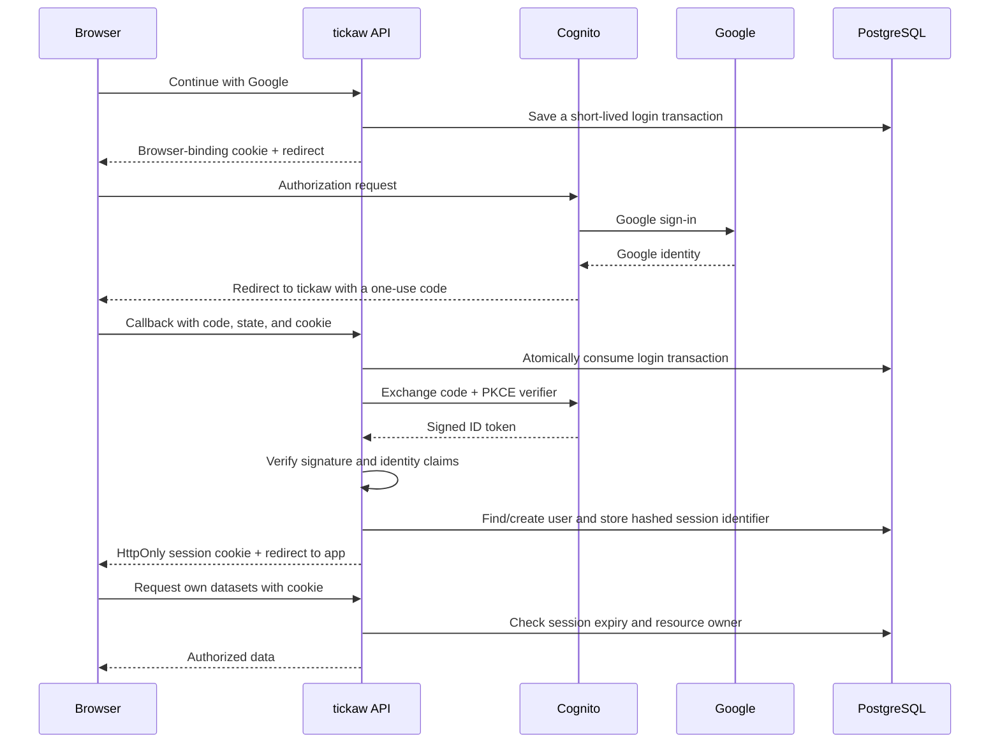

# Google sign-in for tickaw

The application integration is implemented. Real Google sign-in needs a Google OAuth client and a Cognito user pool/app client configured by you. No AWS authentication resources have been created by this change. Provider configuration and a live two-account sign-in check are still required before deploying.

## What each system does

**Google** checks who the person is. tickaw never sees their Google password. **Cognito** connects that Google account to a stable identity in your AWS user pool. **tickaw** verifies Cognito's identity proof and records its own user and browser session in PostgreSQL.

Authentication answers “who is this?” Authorization answers “may this person access this dataset or notebook?” Signing in alone does not protect data: the API checks ownership separately on each resource request.



The **authorization code** is a short-lived receipt; it is not the final session. **PKCE** binds that receipt to a secret created when this login began. **State** and a browser-binding cookie tie the callback to the browser that started it. **Nonce** ties the signed identity token to the same login transaction. The transaction expires after ten minutes and can be used once.

A **JWT** is a signed message containing identity claims. PyJWT verifies Cognito's RSA signature using public keys obtained from the configured issuer; the API also verifies the issuer, client audience, expiry, issue time, nonce, token purpose, verified email, and Google provider identity. Merely decoding a JWT would not establish trust.

A **session cookie** is a random identifier that the browser sends automatically to the API. PostgreSQL stores only its SHA-256 hash. HttpOnly prevents JavaScript from reading it; Secure restricts it to HTTPS; SameSite=Lax limits cross-site cookie use while allowing the sign-in redirect. Write requests additionally require an exact match to the configured Origin header. Tokens are never placed in browser storage or returned to frontend JavaScript.

## Configure Google and Cognito

Use separate development and production clients/pools. Start with development; creating AWS resources can incur charges, so review [Cognito pricing](https://aws.amazon.com/cognito/pricing/) before creating them.

1. In Google Cloud Console, create/select a project and configure Google Auth Platform branding, audience, and data access. Request only `openid`, `email`, and `profile`. While the app is in external testing mode, add your Google account and a second test account as test users. You do not need Gmail or Drive access.
2. Create a Google OAuth client of type **Web application**. Save its client ID and client secret privately. This client belongs to the Google-to-Cognito connection.
3. In AWS Cognito, create a **user pool** for tickaw. This is different from an identity pool: users access S3 through your backend, so an identity pool and browser AWS credentials are unnecessary. Disable public native self-registration for this Google-only app. Avoid making extra attributes mandatory.
4. Add a Cognito user pool domain. Its base URL will look like `https://YOUR-PREFIX.auth.us-east-1.amazoncognito.com` (use your actual region). This is `AUTH_DOMAIN`.
5. Return to the Google OAuth client and add this exact authorized redirect URI:
   ```text
   https://YOUR-PREFIX.auth.us-east-1.amazoncognito.com/oauth2/idpresponse
   ```
   Google sends its response to Cognito at this address. It does not send it directly to tickaw. No Google JavaScript origins are needed for this server redirect flow.
6. In Cognito's social identity providers, add **Google** using that Google client ID/secret. Configure Google scopes `openid email profile`. Map Google `email` to Cognito `email` and Google `email_verified` to Cognito `email_verified`. The API requires a verified email but uses the stable Cognito subject as identity; email addresses are not used to merge accounts.
7. Create/configure a Cognito **app client** for the traditional web application. Enable **Google** as the identity provider and **authorization code grant** as the OAuth flow; do not enable implicit grant. Allow scopes `openid`, `email`, and `profile`, and permit reading and writing the mapped email attributes. A client secret is supported and belongs only on the backend. This is a different client ID/secret from the Google pair.
8. Set Cognito's allowed callback URL to:
   ```text
   http://localhost:5173/api/v1/auth/callback
   ```
   The Vite proxy forwards this path to FastAPI. Register this complete URL, including the port and path. Do not use port 8000 for this callback. If Cognito requires a sign-out URL, use `http://localhost:5173/`; the current tickaw sign-out button revokes the local session rather than calling Cognito logout.
9. Find the user pool's issuer. For a standard regional pool it looks like:
   ```text
   https://cognito-idp.us-east-1.amazonaws.com/us-east-1_YOURPOOLID
   ```
   Use the actual issuer for your pool. It differs from the login domain.

See Google's [OpenID Connect setup](https://developers.google.com/identity/openid-connect/openid-connect), AWS's [attribute mapping guidance](https://docs.aws.amazon.com/cognito/latest/developerguide/cognito-user-pools-specifying-attribute-mapping.html), and AWS's [Google identity provider setup](https://docs.aws.amazon.com/cognito/latest/developerguide/cognito-user-pools-social-idp.html), [authorization endpoint](https://docs.aws.amazon.com/cognito/latest/developerguide/authorization-endpoint.html), and [token endpoint](https://docs.aws.amazon.com/cognito/latest/developerguide/token-endpoint.html). Console labels can change; the important settings are the provider, scopes, grant type, mappings, and exact redirects above.

## Configure the local application

Add these to your existing `.env` without overwriting its other settings:

```dotenv
AUTH_ISSUER=https://cognito-idp.us-east-1.amazonaws.com/us-east-1_YOURPOOLID
AUTH_DOMAIN=https://YOUR-PREFIX.auth.us-east-1.amazoncognito.com
AUTH_CLIENT_ID=YOUR_COGNITO_APP_CLIENT_ID
AUTH_CLIENT_SECRET=YOUR_COGNITO_APP_CLIENT_SECRET
AUTH_APP_ORIGIN=http://localhost:5173
AUTH_COOKIE_SECURE=false
AUTH_SESSION_SECONDS=3600
```

Leave `AUTH_CLIENT_SECRET` empty only if the Cognito app client was created without one. The Google secret stays in Cognito; the app's secret above is Cognito's. Never put either secret in `VITE_` variables, Git, screenshots, or chat. In AWS deployment, supply backend secrets through Secrets Manager.

Start the services, rebuild the API and workers for the JWT dependency, and apply the migration before serving requests:

```sh
docker --host unix:///Users/christran/.docker/run/docker.sock compose up -d postgres redis minio
docker --host unix:///Users/christran/.docker/run/docker.sock compose build api profiling-worker analysis-worker
docker --host unix:///Users/christran/.docker/run/docker.sock compose run --rm api alembic upgrade head
docker --host unix:///Users/christran/.docker/run/docker.sock compose up -d api web profiling-worker analysis-worker
```

Open `http://localhost:5173`, click Continue with Google, and choose a configured test user. Without Cognito configuration, the API refuses login with a setup error; it does not fall back to anonymous access. The settings in `.env.example` are examples and are not automatically copied into an existing `.env`.

For HTTPS deployment, change `AUTH_APP_ORIGIN` to your real HTTPS origin, set `AUTH_COOKIE_SECURE=true`, and register its exact `/api/v1/auth/callback` URL in Cognito. Route the frontend and `/api` through the same public origin. The API rejects insecure non-localhost configurations. CORS alone is not an access-control mechanism.

## Ownership and existing demo records

New datasets and notebooks receive the authenticated internal user ID. Versions inherit dataset ownership. Cells and analyses inherit notebook ownership, and the API also checks their referenced dataset. List queries filter ownership **before** pagination. Foreign and unknown resources both return 404. Workers remain internal services; browser users cannot directly access the database, Redis, or storage.

The migration adds nullable ownership to preserve old records. Existing ownerless records remain in the database and object storage but are hidden from all accounts. They are not given to the first person who signs in. To explicitly adopt your old local demo data, sign in, obtain your `id` from `/api/v1/auth/me`, then preview:

```sh
docker --host unix:///Users/christran/.docker/run/docker.sock compose exec -T api python -m app.scripts.assign_legacy_owner --user-id YOUR_INTERNAL_USER_UUID
```

Review the counts and target ID, then repeat with `--apply` if those are the records you want. This administrator CLI adopts **all ownerless datasets and notebooks**; it leaves already-owned records unchanged and refuses notebooks referencing another user's dataset. It has no public API endpoint. Never run it against a shared environment without reviewing the legacy records.

## Sessions and sign-out

Sessions last at most one hour, capped by the verified ID token's expiry. This version discards provider access/refresh tokens and does not silently refresh sessions. An expired API session returns 401 and the frontend returns to sign-in. Logging in again rotates the current browser session. Other browsers retain their separate sessions.

Sign out removes this browser's database session and cookie, immediately making the old cookie unusable. It does not sign the person out of Google or clear Cognito's own browser session; the next login may therefore be quick. Google/Cognito account revocation does not immediately revoke an already-issued tickaw session: it expires within an hour unless an administrator deletes its session records. Global logout, account deletion, and revocation-event integration are follow-up features.

Login requests remove expired transactions and sessions. A scheduled cleanup can be added later if needed. No personal spreadsheet contents or credentials are needed for authentication logs. API responses use `Cache-Control: no-store`; the Docker API disables access logs because callback query strings contain authorization codes. Any production reverse proxy or load balancer must omit/redact callback query strings from logs too.

## Verify before real users

Automated checks cover forged/wrong/expired JWTs, PKCE, Origin checks, anonymous API denial, real database sessions, logout and expiry, browser-bound one-use callbacks, session rotation, and cross-user access to datasets, versions, notebooks, retries, clarifications, and results. The provider exchange is simulated in the integration harness; these tests do not prove the external Google/Cognito configuration.

```sh
PYTHONPATH=.:apps/api .venv/bin/python -m pytest tests/unit -q
npm --prefix apps/web run build
docker --host unix:///Users/christran/.docker/run/docker.sock compose run --rm api python -m tests.check_migrations
```

After configuration, verify with two Google accounts in separate browser profiles: upload and analyze under account A; confirm B sees none of A's records and receives 404 when requesting their IDs; sign out and confirm protected requests fail. Check that production cookies have Secure and HttpOnly enabled. Keep PostgreSQL, Redis, and object storage private; local Docker's published development ports are not an AWS production configuration.

## Validation recorded for this change

On October 1, 2026: 216 Python unit tests passed (27 authentication tests); the frontend production build passed; the disposable PostgreSQL/MinIO harness passed schema agreement, fresh upgrade, downgrade/re-upgrade, existing application integration checks, and authentication/ownership checks. Migration 0014 was applied to the local development database. The sign-in screen was checked in the browser. Live Google/Cognito sign-in remains unverified pending provider configuration. No live model evaluations or AWS provisioning occurred.
